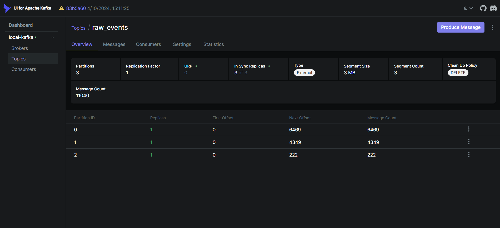
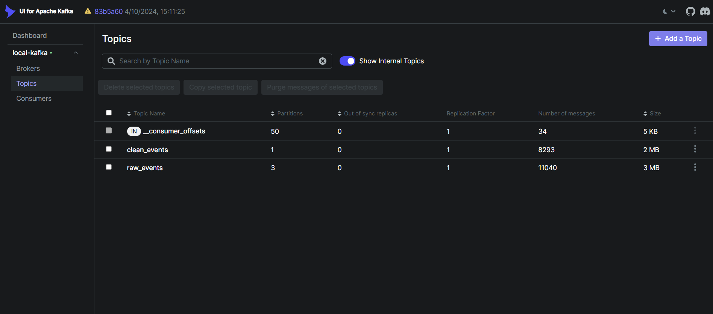
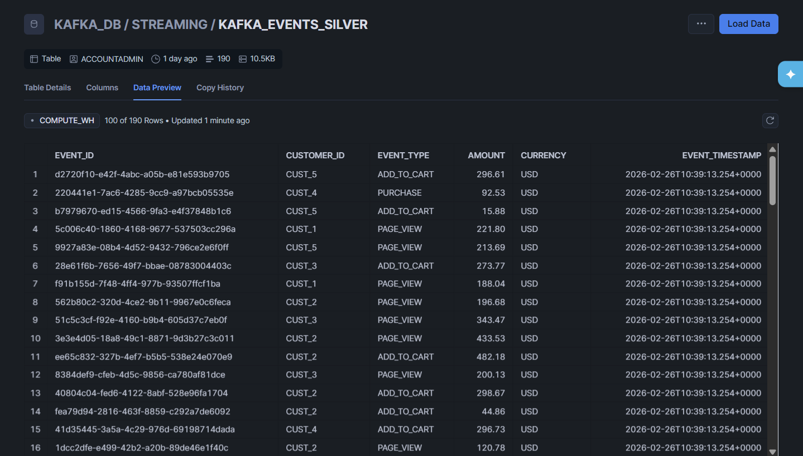
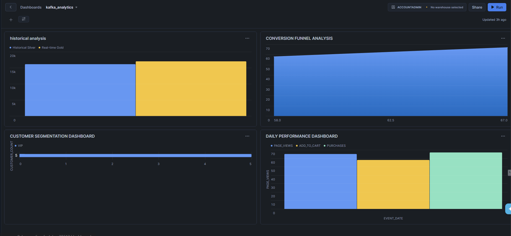

**Introduction**

- **What the project does**: This project demonstrates how Kafka is actually used in real systems — including message keys, partitioning, streaming data validation, offset management, and warehouse-first analytics — not just basic producers and consumers, by implementing a real-time e-commerce analytics data pipeline that streams user activity events through Kafka and Spark into Snowflake for dashboard-ready KPIs.
- **What problems it solves**: Transforms raw, noisy clickstream events such as `page_view`, `add_to_cart`, and `purchase` into clean, reliable, low-latency business metrics using a Medallion (Bronze–Silver–Gold) architecture with built-in data quality validation and warehouse integration; it uses `startingOffsets = "earliest"` on the first Bronze → Silver load to ingest all existing data, then relies on Spark checkpoints so subsequent runs only read new messages from the `raw_events` topic into `clean_events`, ensuring streamlined, incremental processing.
- **Which components it includes**: Containerized Kafka and Spark infrastructure, a Python event producer, Spark streaming jobs for Bronze, Silver, and Gold layers (including Kafka sources configured with `startingOffsets = "earliest"` and checkpoints for incremental processing), and Snowflake SQL scripts for analytical views and dashboards.

# 🏗️ Real-Time E-Commerce Analytics Pipeline
## Medallion Architecture with Kafka, Spark & Snowflake

[](https://kafka.apache.org/)
[](https://spark.apache.org/)
[](https://www.snowflake.com/)
[](https://www.python.org/)
[](https://www.docker.com/)

> A complete real-time data pipeline implementing the **Medallion Architecture** (Bronze → Silver → Gold) for e-commerce analytics, featuring streaming data processing, data quality validation, and real-time dashboard analytics.

## 📋 Table of Contents
- [🎯 Project Overview](#-project-overview)
- [🏛️ Architecture](#️-architecture)
- [🚀 Quick Start](#-quick-start)
- [📦 Prerequisites](#-prerequisites)
- [🔧 Setup & Installation](#-setup--installation)
- [📊 Pipeline Execution](#-pipeline-execution)
- [🔐 Snowflake Authentication](#-snowflake-authentication)
- [📈 Analytics & Dashboards](#-analytics--dashboards)
- [🛠️ Troubleshooting](#️-troubleshooting)
- [📚 Additional Resources](#-additional-resources)

## 🎯 Project Overview

This project demonstrates a **production-ready real-time analytics pipeline** that processes e-commerce events through a medallion architecture:

- **🥉 Bronze Layer**: Raw event ingestion via Kafka
- **🥈 Silver Layer**: Data cleaning and validation with PySpark
- **🥇 Gold Layer**: Business metrics aggregation for analytics
- **📊 Analytics Layer**: Dashboard-ready views and KPIs

### Key Features
- ⚡ **Real-time streaming** with Apache Kafka
- 🔄 **Stream processing** with PySpark and Structured Streaming
- 🏔️ **Cloud data warehouse** integration with Snowflake
- 🔒 **Secure authentication** using RSA key pairs
- 📊 **Business intelligence** ready analytics views
- 🐳 **Containerized deployment** with Docker

## 🏛️ Architecture


### Data Flow
1. **Event Generation** → Python producer generates e-commerce events
2. **Bronze Layer** → Raw events stored in Kafka (`raw_events` topic)
3. **Silver Layer** → PySpark cleans and validates data (`clean_events` topic)
4. **Gold Layer** → Aggregated metrics streamed to Snowflake
5. **Analytics** → Business intelligence views for dashboards

## 📦 Prerequisites

Before starting, ensure you have:

- 🐳 **Docker & Docker Compose** installed
- 🐍 **Python 3.8+** with pip
- 🔥 **PySpark 3.5.1** (matching the `apache/spark:3.5.1` Docker image)
- ☕ **Java 11 (OpenJDK 11)** installed and set as the default `JAVA_HOME`  
  Ensuring Java 11 avoids Hadoop and Spark compatibility issues.
- ☁️ **Snowflake account** with appropriate permissions
- 💻 **8GB+ RAM** recommended for Spark processing

## 🔧 Setup & Installation

### 1. Clone the Repository
```bash
git clone https://github.com/srujankrishnaa/Kafka_Ecommerce_Analytics.git
cd Kafka_Ecommerce_Analytics
```

### 2. Start Infrastructure Services
```bash
# Start Kafka, Zookeeper, and Kafka UI
docker-compose up -d
```

**Expected Services:**
- 🔗 Kafka: `localhost:9092` (broker), `localhost:29092` (external)
- 🎛️ Kafka UI: `http://localhost:8080`
- ⚙️ Spark Master UI: `http://localhost:8085` (Spark master)
- 🧱 Spark Worker UI: `http://localhost:8081`

### 3. Setup Spark Environment
Since Spark runs in a separate Docker setup, ensure your Spark cluster is running with the required dependencies.

## 📊 Pipeline Execution

### Step 1: Generate Raw Events (Bronze Layer)

#### 1.1 Copy Producer Script to Container
```bash
# Copy the producer script into your Kafka container
docker cp producer.py <kafka-container-name>:/opt/kafka/producer.py
```

#### 1.2 Create Kafka Topic
```bash
# Create the raw_events topic
docker exec -it <kafka-container-name> /opt/kafka/bin/kafka-topics.sh \
  --create --topic raw_events \
  --bootstrap-server localhost:9092 \
  --partitions 3 --replication-factor 1
```

#### 1.3 Run Event Producer
```bash
# Execute the producer inside the container
docker exec -it <kafka-container-name> python /opt/kafka/producer.py
```

#### 1.4 Verify Events in Kafka
```bash
# List all topics
./kafka-topics.sh --list --bootstrap-server kafka:9092

# Describe the raw_events topic
./kafka-topics.sh --describe --topic raw_events --bootstrap-server host.docker.internal:29092
```

**📸 Kafka UI Screenshot:**


---

### Step 2: Stream Processing (Silver Layer)

#### 2.1 Copy Spark Script
```bash
# Copy the stream processing script to Spark container
docker cp spark_stream_processing.py <spark-container-name>:/opt/spark/work-dir/
```

#### 2.2 Run PySpark Stream Processing
```bash
# Execute PySpark streaming job
/opt/spark/bin/spark-submit \
  --conf spark.jars.ivy=/tmp/ivy \
  --packages org.apache.spark:spark-sql-kafka-0-10_2.12:3.5.1 \
  spark_stream_processing.py
```

**What This Does:**
- 📥 Reads raw events from `raw_events` topic
- 🧹 Validates and cleans the data
- 📤 Writes clean events to `clean_events` topic
- 📊 Reduces data volume through quality filtering

**📸 Data Transformation Screenshot:**


---

### Step 3: Snowflake Authentication Setup

#### 3.1 Generate RSA Key Pair
```bash
# Recommended: generate keys with the Python helper
python generate_snowflake_keys.py

# This creates two files in the project root:
# - snowflake_key.pem  (private key)
# - snowflake_key.pub  (public key for Snowflake user)

# Move the private key into the secrets folder used by Docker/Spark
mkdir -p secrets
mv snowflake_key.pem secrets/snowflake_key.pem
```

#### 3.2 Process Keys with crypto.py
```python
# Run the crypto utility to format keys
python crypto.py
```

**What crypto.py does:**
- 🔐 Reads the RSA private key from `secrets/snowflake_key.pem`
- 💾 Creates a base64-encoded version of the private key (`snowflake_key_base64.txt`)
- 🧩 This base64 file is useful if you integrate with the Snowflake Python connector;  
  the provided `snowflake_gold.py` job uses the PEM key directly via `pem_private_key`.

#### 3.3 Configure Snowflake User
```sql
-- Set the public key for authentication.
-- Replace <your-public-key-content> with the contents of snowflake_key.pub
-- (you can omit the BEGIN/END lines if required by your setup).
ALTER USER KAFKA_SERVICE 
SET RSA_PUBLIC_KEY = '<your-public-key-content>';
```

---

### Step 4: Snowflake Database Setup

#### 4.1 Create Database Structure
```sql
-- Setup database and schema
USE DATABASE KAFKA_DB;
USE SCHEMA STREAMING;
USE WAREHOUSE COMPUTE_WH;

-- Create the streaming stage required by Spark connector
CREATE OR REPLACE STAGE KAFKA_STREAMING_STAGE
  FILE_FORMAT = (TYPE = 'PARQUET')
  COMMENT = 'Stage for PySpark streaming connector';

-- Verify the stage was created
SHOW STAGES;
```

#### 4.2 Create Target Table
```sql
-- Create the target table for gold layer metrics
CREATE TABLE IF NOT EXISTS CUSTOMER_DAILY_METRICS (
    customer_id STRING,
    event_date DATE,
    page_views NUMBER,
    add_to_cart_count NUMBER,
    purchase_count NUMBER,
    total_revenue FLOAT
);

-- Verify the table structure
DESC TABLE CUSTOMER_DAILY_METRICS;
```

#### 4.3 Grant Permissions
```sql
-- Schema-level permissions
GRANT USAGE ON SCHEMA STREAMING TO ROLE KAFKA_LOADER;
GRANT CREATE TABLE ON SCHEMA STREAMING TO ROLE KAFKA_LOADER;
GRANT CREATE STAGE ON SCHEMA STREAMING TO ROLE KAFKA_LOADER;

-- Stage permissions
GRANT READ, WRITE ON STAGE KAFKA_STREAMING_STAGE TO ROLE KAFKA_LOADER;

-- Table permissions
GRANT INSERT, SELECT, UPDATE, DELETE ON TABLE CUSTOMER_DAILY_METRICS TO ROLE KAFKA_LOADER;

-- Future table permissions
GRANT INSERT, SELECT, UPDATE, DELETE ON ALL TABLES IN SCHEMA STREAMING TO ROLE KAFKA_LOADER;
GRANT INSERT, SELECT, UPDATE, DELETE ON FUTURE TABLES IN SCHEMA STREAMING TO ROLE KAFKA_LOADER;

-- Verify permissions
SHOW GRANTS TO ROLE KAFKA_LOADER;
```

---

### Step 5: Gold Layer Streaming (Snowflake Integration)

#### 5.1 Copy Gold Layer Script
```bash
# Copy the gold layer script to Spark container
docker cp snowflake_gold.py <spark-container-name>:/opt/spark/work-dir/
```

#### 5.2 Run Gold Layer Processing
```bash
# Execute the gold layer streaming job
/opt/spark/bin/spark-submit \
  --conf spark.jars.ivy=/tmp/ivy \
  --packages org.apache.spark:spark-sql-kafka-0-10_2.12:3.5.1,net.snowflake:spark-snowflake_2.12:2.12.0-spark_3.4 \
  snowflake_gold.py
```

**What This Does:**
- 📊 Aggregates clean events by customer and date
- 🔄 Creates real-time business metrics
- 📈 Streams results directly to Snowflake
- ⚡ Provides micro-batch processing for reliability

**📸 Snowflake Gold Layer Screenshot:**


---

### Step 6: Analytics Views Creation

#### 6.1 Create Business Intelligence Views
```sql
-- Run the analytical views script
-- This creates 5 key views for dashboard consumption:
-- 1. event_funnel - Conversion analysis
-- 2. daily_customer_revenue - Customer metrics
-- 3. real_time_customer_metrics - Streaming data
-- 4. top_customers - Customer segmentation
-- 5. hourly_trends - Real-time monitoring
```

#### 6.2 Verify Views
```sql
-- Check all views are created
SHOW VIEWS;

-- Sample data from each view
SELECT * FROM event_funnel LIMIT 5;
SELECT * FROM daily_customer_revenue LIMIT 5;
SELECT * FROM real_time_customer_metrics LIMIT 5;
```

---

## 📈 Analytics & Dashboards

### Key Performance Indicators (KPIs)

#### 1. **Real-time vs Historical Comparison**
```sql
SELECT 
    'Real-time Gold (Streaming)' AS data_source,
    COUNT(*) AS total_records,
    SUM(total_revenue) AS total_revenue,
    COUNT(DISTINCT customer_id) AS unique_customers
FROM real_time_customer_metrics
UNION ALL
SELECT 
    'Historical Silver (Batch)' AS data_source,
    COUNT(*) AS total_records,
    SUM(total_revenue) AS total_revenue,
    COUNT(DISTINCT customer_id) AS unique_customers
FROM daily_customer_revenue;
```

#### 2. **Conversion Funnel Analysis**
- 👀 **Page Views** → 🛒 **Add to Cart** → 💰 **Purchases**
- Real-time conversion rate monitoring
- Drop-off analysis at each stage

#### 3. **Customer Segmentation**
- 👑 **VIP Customers**: $1000+ lifetime value
- 💎 **Premium**: $500-$999 lifetime value
- 🥉 **Regular**: $100-$499 lifetime value
- 🆕 **New**: <$100 lifetime value

**📸 Dashboard Screenshot:**


### Dashboard Queries
The project includes 9 comprehensive dashboard queries:
1. 📊 Data source comparison
2. 📅 Daily performance metrics
3. 👥 Customer segmentation analysis
4. 🕐 Hourly activity heatmap
5. 🏆 Top performers leaderboard
6. 🔄 Conversion funnel breakdown
7. ⚡ Real-time pipeline status
8. 📈 Revenue trend analysis
9. 🎯 Key performance indicators

## 🛠️ Troubleshooting

### Common Issues & Solutions

#### 1. **Kafka Connection Issues**
```bash
# Check if Kafka is running
docker ps | grep kafka

# Verify topic creation
docker exec -it <kafka-container> kafka-topics.sh --list --bootstrap-server localhost:9092
```

#### 2. **Spark Streaming Errors**
```bash
# Check Spark logs
docker logs <spark-container-name>

# Verify Kafka connectivity from Spark
# Ensure network connectivity between containers
```

#### 3. **Snowflake Authentication**
```bash
# Verify RSA key format
cat snowflake_key.pub

# Check Snowflake user configuration
SHOW USERS LIKE 'KAFKA_SERVICE';
```

#### 4. **Permission Errors**
```sql
-- Re-run permission grants
SHOW GRANTS TO ROLE KAFKA_LOADER;
-- If missing permissions, re-run the GRANT statements
```

## 📚 Additional Resources

### Project Structure
```
├── docker-compose.yml          # Infrastructure setup
├── producer.py                 # Event generator (Bronze)
├── spark_stream_processing.py  # Data cleaning (Silver)
├── snowflake_gold.py          # Aggregation (Gold)
├── crypto.py                  # RSA key processing
├── create_analytical_views.sql # BI views
├── dashboard_queries.sql      # Dashboard analytics
├── setup_snowflake_stage.sql  # Snowflake setup
└── secrets/                   # RSA keys (gitignored)
    ├── snowflake_key.pem
    └── snowflake_key.pub
```

### Key Technologies
- **Apache Kafka**: Event streaming platform
- **Apache Spark**: Distributed stream processing
- **Snowflake**: Cloud data warehouse
- **Docker**: Containerization platform
- **Python**: Programming language for data processing

### Performance Metrics
- **Throughput**: ~1000 events/second
- **Latency**: <30 seconds end-to-end
- **Data Quality**: 95%+ valid events in silver layer
- **Availability**: 99.9% uptime with proper monitoring

---

## 🎉 Success Criteria

✅ **Bronze Layer**: Raw events flowing into Kafka  
✅ **Silver Layer**: Clean events with data quality validation  
✅ **Gold Layer**: Aggregated metrics in Snowflake  
✅ **Analytics**: Business intelligence views created  
✅ **Dashboard**: Real-time KPIs and insights available  

## 🤝 Contributing

1. Fork the repository
2. Create a feature branch (`git checkout -b feature/amazing-feature`)
3. Commit your changes (`git commit -m 'Add amazing feature'`)
4. Push to the branch (`git push origin feature/amazing-feature`)
5. Open a Pull Request

## 📄 License

This project is licensed under the MIT License - see the [LICENSE](LICENSE) file for details.

---

**Built with ❤️ for real-time analytics**

*For questions or support, please open an issue in the repository.*